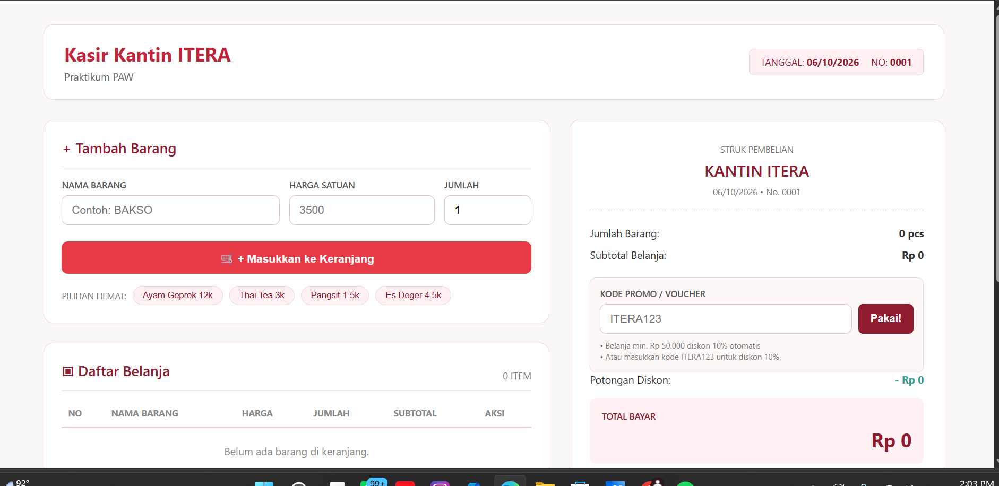
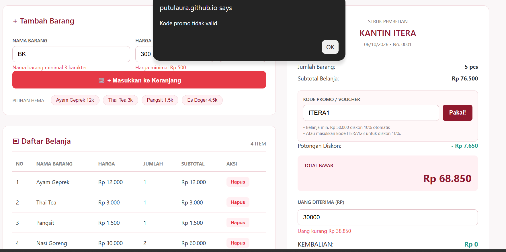
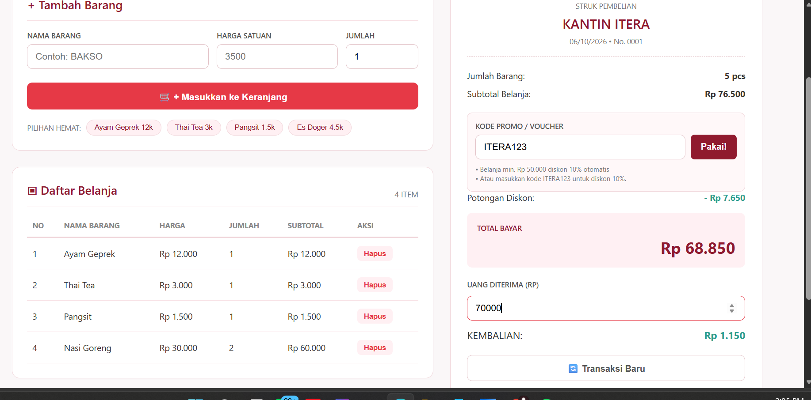

# Kasir Kantin ITERA - Mini POS

## Identitas

Nama Lengkap: Putu Laura Claudia Ardani  
NIM: 124140021  
Kelas Praktikum: RB

## Deskripsi Aplikasi

Aplikasi yang saya buat adalah aplikasi kasir sederhana untuk kantin atau toko kampus.
Aplikasi ini digunakan untuk memasukkan barang yang dibeli, menghitung total harga,
menghitung diskon, pembayaran, dan kembalian.

Saya membuat aplikasi ini untuk menerapkan materi praktikum yang sudah dipelajari,
terutama penggunaan JavaScript untuk validasi input, perhitungan, dan penyimpanan
data menggunakan localStorage.

Studi kasus yang digunakan adalah **Kasir Kantin ITERA**.

## Cara Menjalankan

Untuk menjalankan aplikasi ini caranya:

1. Download atau clone repository.
2. Buka folder project menggunakan Visual Studio Code.
3. Pastikan file `index.html`, `style.css`, dan `script.js` berada dalam satu folder.
4. Buka file `index.html`.
5. Bisa dijalankan langsung di browser atau menggunakan Live Server.
6. Jika menggunakan Live Server, klik kanan `index.html` lalu pilih **Open with Live Server**.

## Fitur yang Dibuat

Beberapa fitur yang ada di aplikasi:

- Input nama barang, harga, dan jumlah barang.
- Validasi nama barang minimal 3 karakter.
- Validasi harga minimal Rp500.
- Validasi jumlah barang minimal 1 dan harus berupa angka bulat.
- Menampilkan pesan error jika input tidak sesuai.
- Menambahkan barang ke daftar belanja.
- Menghitung subtotal setiap barang.
- Menghitung total semua barang.
- Menghapus barang dari keranjang.
- Diskon 10% jika total belanja mencapai Rp50.000.
- Menggunakan kode promo `ITERA123`.
- Menghitung uang kembalian.
- Memberikan keterangan jika uang yang dibayar masih kurang.
- Menyimpan isi keranjang menggunakan `localStorage`.
- Data keranjang tetap ada ketika halaman di-refresh.
- Tombol transaksi baru untuk mengosongkan keranjang.

## Screenshot

### 1. Tampilan Form Input

Screenshot ini menunjukkan tampilan awal aplikasi dan form untuk memasukkan barang.



### 2. Tampilan Validasi

Screenshot ini menunjukkan ketika input yang dimasukkan tidak sesuai, sehingga muncul pesan error.



### 3. Tampilan Transaksi

Screenshot ini menunjukkan barang yang sudah masuk ke keranjang, total belanja, diskon, uang pembayaran, dan kembalian.



## Penjelasan Program

### Validasi Input

Sebelum barang dimasukkan ke keranjang, data akan dicek terlebih dahulu.

Nama barang harus diisi dan minimal 3 karakter. Harga barang minimal Rp500 dan
jumlah barang harus berupa angka bulat dengan nilai minimal 1.

Kalau ada data yang salah, akan muncul pesan error di bawah input dan barang tidak
akan masuk ke keranjang.

### Perhitungan Barang

Subtotal barang dihitung dari harga dikali jumlah barang.

Contohnya:

`Harga Rp3.000 x Qty 2 = Rp6.000`

Setelah itu subtotal dari semua barang dijumlahkan untuk mendapatkan total belanja.

### Diskon

Kalau total belanja sudah mencapai Rp50.000, maka mendapatkan diskon 10%.

Selain itu tersedia kode promo `HEMAT10` yang juga bisa digunakan untuk mendapatkan
diskon 10%.

### Pembayaran

Kasir bisa memasukkan uang yang diberikan oleh pembeli. Program kemudian menghitung
kembalian secara otomatis.

Rumus yang digunakan:

`Kembalian = Uang Bayar - Total Akhir`

Kalau uang yang diberikan kurang, program akan menampilkan pesan bahwa uang belum mencukupi.

### LocalStorage

Data barang yang ada di keranjang disimpan menggunakan `localStorage`.

Data keranjang disimpan menggunakan:

```javascript
localStorage.setItem("keranjang", JSON.stringify(keranjang));
```
